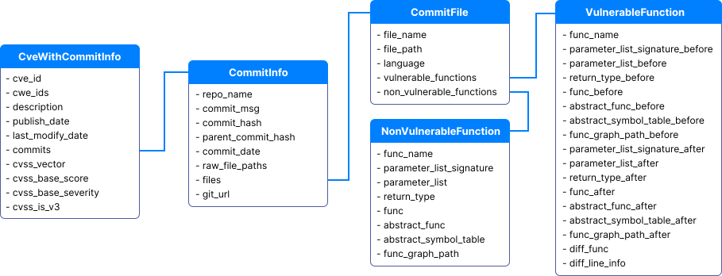
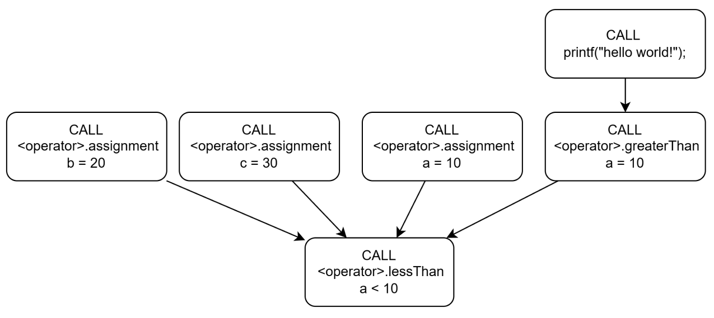
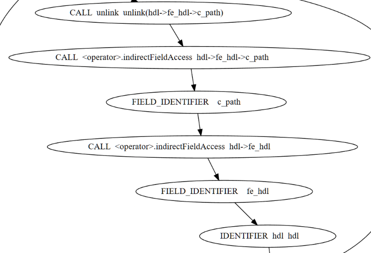
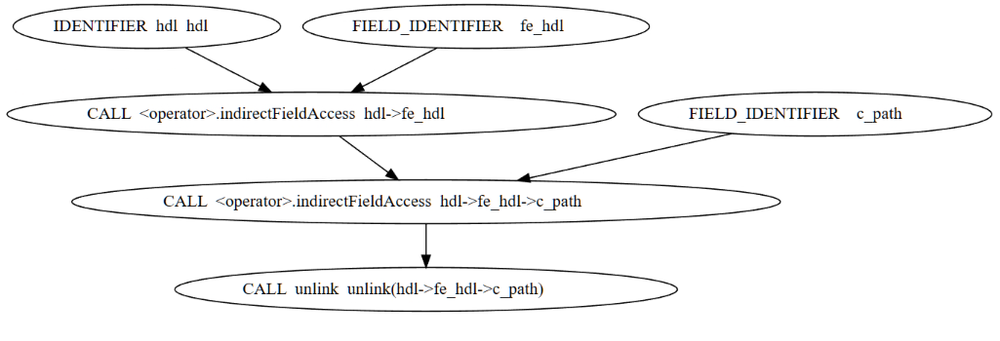
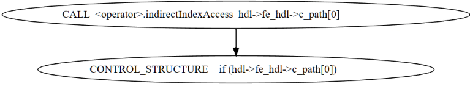
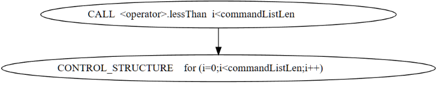
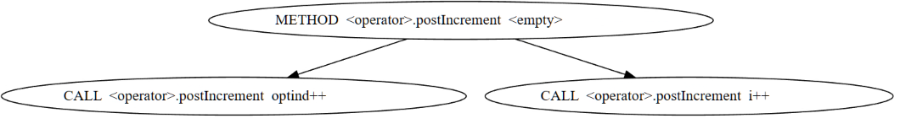
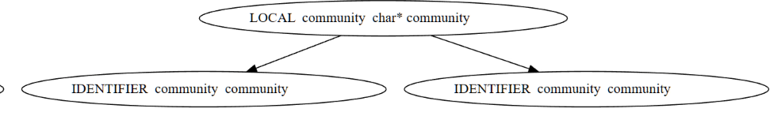
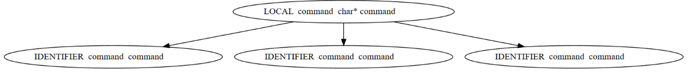

<p align="center">
  
</p>


# MegaVul 📦
> The largest, high-quality, extensible, continuously updated, C/C++ function-level vulnerability dataset.

With over **17,000** identified vulnerable functions and **320,000** non-vulnerable functions extracted from **9,000** vulnerability fix commits,
MegaVul provides multi-dimensional data to help you train state-of-the-art **sequence-based** or **graph-based**
vulnerability detectors.

Table of Contents
- [Getting Started](#getting-started)
   + [🔗 Download Dataset](#-download-dataset)
   + [⏩ Simple UseCase](#-simple-usecase)
- [🐛 Crawling From Scratch](#-crawling-from-scratch)
   + [💡 Prerequisites](#prerequisites)
   + [🚀 Run the pipelines](#-run-the-pipelines)
- [🛠️ Extend More](#-extend-more)
- [📚 Appendix](#-appendix)
   + [Specification](#specification)
      - [Dataset Specification](#dataset-specification)
      - [Graph Specification](#graph-specification)
         * [Node](#node)
         * [Edge](#edge)
         * [Graph Samples](#graph-samples)
   + [Citation](#citation)
   + [License](#license)

------

## Getting Started

We offer **three** versions of the pre-crawled **MegaVul**, as well as providing Joern graphs extracted from all
functions.

The differences between the three versions are as follows:

- `cve_with_graph_abstract_commit.json` Raw dataset with complete hierarchical structure. It includes information
  such as CVE, Commit, :wqFile, Functions, etc.
- `vul4c.json` is a version of `cve_with_graph_abstract_commit` after flattened, for easier use. Keep all
  fields but losing the hierarchical structure.
- `vul4c_simple.json` is a simple version of `vul4c.json`, designed to provide a more concise representation of the
  dataset. It retains essential fields such as Functions and CVE IDs while omitting detail information like function parameter
  lists and commit message.

The **vul4c_graph.zip** provides Joern graphs for all functions in the **MegaVul**, including node and edge information. (Mostly
used for **graph-based** vulnerability detect neural networks)
It is provided separately to save bandwidth and storage space (unzipping requires around **20GB** of free space), and only about 87% of functions successfully generate graphs. 

### 🔗 Download Dataset
[Download from Cloud Drive](https://1drv.ms/f/s!AtzrzuojQf5sgeISZ9zN_4owVnUn9g)
1. `cve_with_graph_abstract_commit.json`
2. `vul4c.json`
3. `vul4c_simple.json`
4. `vul4c_graph.zip`

### ⏩ Simple UseCase

Refer [specification](#dataset-specification) for more information about the **fields** in the dataset.

More code examples can be found in the `examples` folder.

The following code reads `vul4c_simple.json`

```python
import json
from pathlib import Path
graph_dir = Path('path_to_graph/graph')

with Path("path_to_vul4c/vul4c_simple.json").open(mode='r') as f:
    vul4c = json.load(f)
    item = vul4c[9]
    cve_id = item['cve_id'] # CVE-2022-24786
    cvss_vector = item['cvss_vector']   # AV:N/AC:L/Au:N/C:P/I:P/A:P
    is_vul = item['is_vul'] # True
    if is_vul:
        func_before = item['func_before']  # vulnerable function

    func_after = item['func']   # after vul function fixed(i.e., clean function)
    abstract_func_after = item['abstract_func']

    diff_line_info = item['diff_line_info'] # {'deleted_lines': ['pjmedia_rtcp_comm .... ] , 'added_lines': [ .... ] }
    git_url = item['git_url']   # https://github.com/pjsip/pjproject/commit/11559e49e65bdf00922ad5ae28913ec6a198d508

    if item['func_graph_path_before'] is not None:  # graphs of some functions cannot be exported successfully
        graph_file_path = graph_dir / item['func_graph_path_before']
        graph_file = json.load(graph_file_path.open(mode='r'))
        nodes, edges = graph_file['nodes'] , graph_file['edges']
        print(nodes)    # [{'version': '0.1', 'language': 'NEWC', '_label': 'META_DATA', 'overlays': ....
        print(edges)    # [{'inNode': 196, 'outNode': 2, 'etype': 'AST', 'variable': None}, ...]

```

------

## 🐛 Crawling From Scratch

### 💡Prerequisites
- Linux required (Ubuntu 20.04+ recommend)
- Python 3.11+
- 100GB+ free space
- **6+** GitHub tokens (more is better)
- We offer two ways to install dependencies
  1. [Manually install](#Install-dependencies-manually)
  2. [Out-of-box docker image](#Docker-image)

### Install dependencies manually
#### Install python environment

You can choose one of the following three methods to install python dependencies.

- Install from conda (Recommended)
```shell
conda env create -f environment.yml
```

- Direct installation into existing environments
```shell
pip install -r requirements.txt
```

- Install from python venv
```shell
python -m venv .vul4c-env
source .vul4c-env/bin/activate
pip install -r requirements.txt
```

#### Install other dependencies

- [Node.js](https://nodejs.org/) and [Tree-sitter](https://tree-sitter.github.io/) are used to separate functions from files. 
- [Java 17+](https://jdk.java.net/21/), [Scala 3.2.2](https://www.scala-lang.org/), [sbt 1.8.2](https://www.scala-sbt.org/) and [Joern](https://joern.io/) to extract the graph of the function. 
- [Linguist](https://github.com/github-linguist/linguist) is used to detect the language of the header file.

```shell
# install node.js and tree-sitter
sudo apt install -y curl 
curl -sL https://deb.nodesource.com/setup_19.x | sudo -E bash -
sudo apt install -y nodejs 
npm i tree-sitter-cli
which node && which tree-sitter 

# install java,scala and sbt
curl -s "https://get.sdkman.io" | bash
source "$HOME/.sdkman/bin/sdkman-init.sh"
sdk version
sdk install java 17.0.6-amzn
sdk install scala 3.2.2
sdk install sbt 1.8.2
which java && which scala && which sbt 
 
# install ruby, ruby-gem, linguist
sudo apt-get install build-essential cmake pkg-config libicu-dev zlib1g-dev libcurl4-openssl-dev libssl-dev ruby-dev
gem install github-linguist
which github-linguist
```

### Docker image

We provide out-of-box docker image, pull it and run MegaVul straight away!
```shell
docker pull icyrockton/vul4c
docker run -it icyrockton/vul4c
(vul4c) root@8345683f69d9:/Vul4C#: vim vul4c/config.yaml
(vul4c) root@8345683f69d9:/Vul4C#: vim vul4c/github_token.txt
(vul4c) root@8345683f69d9:/Vul4C#: python vul4c/main.py
```

### Config file preparations

Configuration items **need to be filled** in `vul4c/config.yaml` and `vul4c/github_token.txt`.

Generate GitHub RESTful token
1. https://github.com/settings/tokens
2. Generate new token(classic)
3. No scope needs to be checked, fill in the name
4. Directly generate a token starting with `ghp_xxxx` or `gho_xxxx`.

A sample `config.yaml` file is as follows
```yaml
proxy:
  enable: false
  http_url: http://172.31.112.1:1234
  https_url: http://172.31.112.1:1234
dependencies:
  java: /home/tom/.sdkman/candidates/java/current/bin
  scala: /home/tom/.sdkman/candidates/scala/current/bin
  sbt: /home/tom/.sdkman/candidates/sbt/current/bin
  node: /usr/local/node/bin
  tree-sitter: /usr/local/tree-sitter
  github-linguist: /usr/local/bin/github-linguist
log_level:
  DEBUG # [DEBUG, INFO, WARNING, ERROR]
```

Create a empty file named `github_token.txt` and fill it with all github tokens (one line one token)

Sample file:
```text
ghp_xxxx11111
ghp_xxxx22222
```

### 🚀 Run the pipelines


Install vul4c as a python module
```shell
pip install -e .
```

Runs the dataset collection pipelines for Vul4C

```python
python vul4c/main.py
```

☕ Have a cup of coffee and wait for dataset collection to complete (8 hours+).

Intermediate `json` results are stored into `./vul4c/storage/result`, `./vul4c/storage/cache`.

------

## 🛠️ Extend More

### Add more datasource

If you find that some CVEs referenced link website contain potential commits, you can add the parsed commit URLs to [mining_commit_urls_from_reference_urls](https://github.com/Icyrockton/Vul4C/blob/main/vul4c/pipeline/extract_cve_info.py#L90).


### Add more git platform

All git platforms inherit from [GitPlatformBase](https://github.com/Icyrockton/Vul4C/blob/main/vul4c/git_platform/https://git_platform_base.py/), and you need to implement all of its methods to extend a new git platform.


### Tree-sitter enhance

We have extended the grammar of tree-sitter to recognize more C/C++ macros (e.g. `asmlinkage`, `UNUSED`) from other projects such as linux.

The modified tree-sitter grammar file can be found here: [grammar.js](https://github.com/Icyrockton/Vul4C/blob/main/vul4c/tree-sitter/tree-sitter-c/grammar.js#L482).

### Add more language

Our function separator depends on tree-sitter, such as [ParserC](https://github.com/Icyrockton/Vul4C/blob/main/vul4c/parser/parser_c.py).

If you want to extend function separator for more languages, such as `Java`
you can use [tree-sitter-java](https://github.com/tree-sitter/tree-sitter-java) to extend [ParserBase](https://github.com/Icyrockton/Vul4C/blob/main/vul4c/parser/parser_base.py).


## 📚 Appendix

### Specification

#### Dataset Specification

We provide **field** specification for the different versions of Vul4C for easier use (typing support).

You can also find the definition in the `vul4c/git_platform/common.py`, `vul4c/pipeline/flatten_vul4c.py`.

1. `vul4c_simple.json` provides the most commonly used fields of the dataset.
   The definitions are as follows

```python
from dataclasses import dataclass
from typing import Optional
@dataclass
class Vul4CSimpleFunction:
    cve_id: str
    cwe_ids: list[str]
    cvss_vector: Optional[str]
    cvss_is_v3: Optional[bool]

    repo_name: str
    commit_msg: str
    commit_hash: str
    git_url: str
    file_path: str
    func_name: str

    # when `is_vul = 1` xxxxx_before will exist, indicating a vulnerable function.
    func_before: Optional[str]
    abstract_func_before: Optional[str]
    func_graph_path_before: Optional[str | None]

    func: str
    abstract_func: str
    func_graph_path: str | None

    # diff info
    diff_func: Optional[str]
    diff_line_info: Optional[dict]  # [deleted_lines, added_lines]

    is_vul: bool
```

2. `vul4c.json` is the version after `cve_with_graph_abstract_commit` flattened.

```python
@dataclass
class Vul4CFunction:
    cve_id: str
    cwe_ids: list[str]
    cvss_vector: Optional[str]
    cvss_base_score: Optional[float]
    cvss_base_severity: Optional[str]
    cvss_is_v3: Optional[bool]
    publish_date: str

    repo_name: str
    commit_msg: str
    commit_hash: str
    parent_commit_hash: str
    commit_date: int
    git_url: str

    file_path: str
    func_name: str
    # when `is_vul = 1` xxxxx_before will exist, indicating a vulnerable function.
    parameter_list_signature_before: Optional[str]
    parameter_list_before: Optional[list]
    return_type_before: Optional[str]
    func_before: Optional[str]
    abstract_func_before: Optional[str]
    abstract_symbol_table_before: Optional[dict]
    func_graph_path_before: Optional[str | None]

    parameter_list_signature: str
    parameter_list: list
    return_type: str
    func: str
    abstract_func: str
    abstract_symbol_table: dict
    func_graph_path: str | None

    # diff info
    diff_func: Optional[str]
    diff_line_info: Optional[dict]  # [deleted_lines, added_lines]

    is_vul: bool
```

3. `cve_with_graph_abstract_commit.json` provides the following hierarchical structure, which is raw
   state of the dataset. 
The following classes are defined in the [`vul4c/git_platform/common.py`](vul4c/git_platform/common.py)
- `CveWithCommitInfo`
- `CommitInfo`
- `CommitFile`
- `VulnerableFunction`
- `NonVulnerableFunction`




#### Graph Specification

The graphs of functions is extracted by **Joern**, and here we provide a detailed description of the field information
for both **nodes and edges**. You can also visit their [official website](https://cpg.joern.io/) for detailed information.

Joern provides a variety of graph information(i.e., AST, CFG, CDG, DDG, PDG, CPG ), please note the following rules:

- AST
- CFG
- PDG = CDG + DDG
- CPG = AST + CFG + PDG

NB: Joern **can't** export DFG(Data Flow Graph) for functions.

##### Usage

The `func_graph_path`, `func_graph_path_before` in Vul4C provides the relative path to the graph of function, and you
need to concatenate the paths to get the final json file.

e.g.

```python
graph_dir = Path('path_to_graph/graph')
graph_file_path = graph_dir / item['func_graph_path_before']

nodes = graph_file_path['nodes']  # graph nodes
edges = graph_file_path['edges']  # graph edges
```

##### Node

The following table lists the fields that may exist within nodes.

NB: **not all fields will be existed**, only `_label` is guaranteed to be existed.

| Field                    | Description                                                                                                                                                                                                                                                                                                  |
|--------------------------|--------------------------------------------------------------------------------------------------------------------------------------------------------------------------------------------------------------------------------------------------------------------------------------------------------------|
| _label                   | type of Node , possible types: `BINDING`,`BLOCK`,`CALL`,`COMMENT`,`CONTROL_STRUCTURE`,  `FIELD_IDENTIFIER`,`FILE`,`IDENTIFIER`,`JUMP_TARGET`,`LITERAL`,`LOCAL`, `META_DATA`,`METHOD`,`METHOD_PARAMETER_IN`,`METHOD_PARAMETER_OUT`, `METHOD_RETURN`,`NAMESPACE`,`NAMESPACE_BLOCK`,`RETURN`,`TYPE`,`TYPE_DECL` |
| argumentIndex            | position of the parameter in the called function                                                                                                                                                                                                                                                             |
| astParentFullName        | name of the AST parent node. e.g. `<global>`                                                                                                                                                                                                                                                                 |
| astParentType            | type of the AST parent node                                                                                                                                                                                                                                                                                  |
| name                     | function names, variable names, pseudo-node names                                                                                                                                                                                                                                                            |
| code                     | code corresponding to this node                                                                                                                                                                                                                                                                              |
| columnNumber             | node's column position in the source file                                                                                                                                                                                                                                                                    |
| columnNumberEnd          | end position of column in the source file                                                                                                                                                                                                                                                                    |
| lineNumber               | same as above                                                                                                                                                                                                                                                                                                |
| lineNumberEnd            |                                                                                                                                                                                                                                                                                                              |
| controlStructureType     | `WHILE`，`SWITCH`，`BREAK`，`IF`，`GOTO`，`FOR`                                                                                                                                                                                                                                                                   |
| dispatchType             | when the node type is `CALL`, this field exists                                                                                                                                                                                                                                                              |
| dynamicTypeHintFullName  |                                                                                                                                                                                                                                                                                                              |
| evaluationStrategy       | parameter pass by reference or pass by value                                                                                                                                                                                                                                                                 |
| filename                 | file name                                                                                                                                                                                                                                                                                                    |
| fullName                 | function name                                                                                                                                                                                                                                                                                                |
| id                       | node number to be referenced by edges                                                                                                                                                                                                                                                                        |
| index                    | similar to `argumentIndex`                                                                                                                                                                                                                                                                                   |
| inheritsFromTypeFullName |                                                                                                                                                                                                                                                                                                              |
| isExternal               | external functions, not in the source file                                                                                                                                                                                                                                                                   |
| isVariadic               | variadic parameter                                                                                                                                                                                                                                                                                           |
| language                 | file language                                                                                                                                                                                                                                                                                                |
| methodFullName           | when the node type is `CALL`, `methodFullName` is the called function name                                                                                                                                                                                                                                   |
| canonicalName            |                                                                                                                                                                                                                                                                                                              |
| order                    |                                                                                                                                                                                                                                                                                                              |
| overlays                 | overlay used by Joern to parse functions. e.g. `Dataflow Overlay`                                                                                                                                                                                                                                            |
| parserTypeName           | parsed label, goto, if statement. e.g. `CASTIfStatement`                                                                                                                                                                                                                                                     |
| root                     | source file path                                                                                                                                                                                                                                                                                             |
| signature                | function signature                                                                                                                                                                                                                                                                                           |
| typeDeclFullName         |                                                                                                                                                                                                                                                                                                              |
| typeFullName             |                                                                                                                                                                                                                                                                                                              |
| version                  |                                                                                                                                                                                                                                                                                                              |

##### Edge

Edges connect nodes to nodes, forming various graphs, and the other three fields are guaranteed to be present, except
for `variable`.

| Field    | Description                                                                                                                                                                               |
|----------|-------------------------------------------------------------------------------------------------------------------------------------------------------------------------------------------|
| inNode   | start node of the edge                                                                                                                                                                    |
| outNode  | end node of the edge                                                                                                                                                                      |
| label    | type of edge: `ARGUMENT`,`AST`,`BINDS`,`CALL`,`CDG`, `CFG`,`CONDITION`, `CONTAINS`,`DOMINATE`,`EVAL_TYPE`,`PARAMETER_LINK`,`POST_DOMINATE`, `REACHING_DEF`,`RECEIVER`,`REF`,`SOURCE_FILE` |
| variable | variable referenced by edge                                                                                                                                                               |

The most useful types of edges: `AST`, `CDG`, `CFG`, `REACHING_DEF`(aka. DDG)

##### Graph Samples

We exported some less common types of graph to help you understand their meaning more easily.

1. CDG

Control dependency graph

```c
int main(){
    int a = 10;
    while (a < 10) {
        int b = 20;
        int c = 30;
    }
    a = 10;
    if ( a > 10 ){
        printf("hello world!");
    }
}
```



2. CFG

Control flow graph

```c
unlink(hdl->fe_hdl->c_path)
```



3. ARGUMENT

AST for function call arguments



4. CONDITION

Conditions for control statements




4. CALL

Definition of function and call points



5. REF

Definition and reference location of local variables





### Citation

If you use Vul4C for your research, please cite our paper:

```
@InProceedings{
}
```

### License

Vul4C is licensed under the GPL 3.0, as found in the [LICENSE](LICENSE) file.