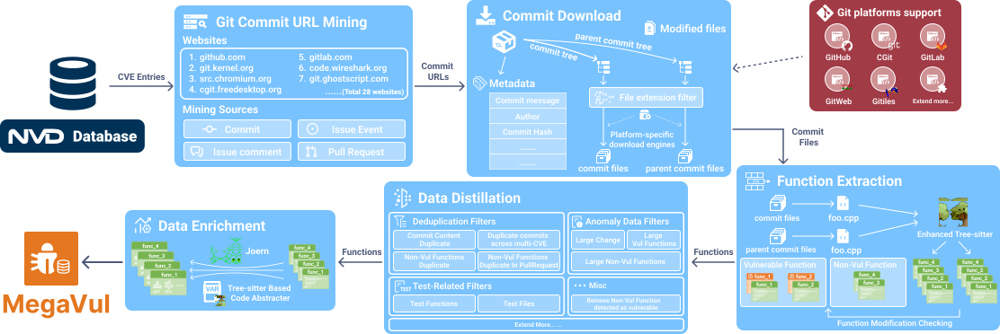

<p align="center">
  
</p>


# MegaVul 📦 [(Paper)](pdf/paper.pdf)
> The largest, high-quality, extensible, continuously updated, C/C++/Java function-level vulnerability dataset.

> [!NOTE]
> MegaVul begins providing vulnerability data for Java

With over **17,000** identified vulnerable functions and **320,000** non-vulnerable functions extracted from **9,000** vulnerability fix commits,
MegaVul provides multi-dimensional data to help you train state-of-the-art **sequence-based** or **graph-based**
vulnerability detectors.


Table of Contents
- [Getting Started](#getting-started)
   + [🔗 Download Dataset](#-download-dataset)
   + [⏩ Simple UseCase](#-simple-usecase)
- [🐛 Crawling From Scratch](#-crawling-from-scratch)
   + [💡 Prerequisites](#prerequisites)
   + [🚀 Run the pipelines](#-run-the-pipelines)
- [🛠️ Extend More](#-extend-more)
- [📚 Appendix](#-appendix)
   + [MegaVul Statistics](#megavul-statistics)
   + [Specification](#specification)
   + [Citation](#citation)
   + [License](#license)

------

## Getting Started

We offer **three** versions of the pre-crawled **MegaVul**, as well as providing Joern graphs extracted from all
functions.

The differences between the three versions are as follows:

- `cve_with_graph_abstract_commit.json` Raw dataset with complete hierarchical structure. It includes information
  such as CVE, Commit, :wqFile, Functions, etc.
- `megavul.json` is a version of `cve_with_graph_abstract_commit` after flattened, for easier use. Keep all
  fields but losing the hierarchical structure.
- `megavul_simple.json` is a simple version of `megavul.json`, designed to provide a more concise representation of the
  dataset. It retains essential fields such as Functions and CVE IDs while omitting detail information like function parameter
  lists and commit message.

The **megavul_graph.zip** provides Joern graphs for all functions in the **MegaVul**, including node and edge information. (Mostly
used for **graph-based** vulnerability detect neural networks)
It is provided separately to save bandwidth and storage space (unzipping requires around **20GB** of free space), and only about 87% of functions successfully generate graphs. 

### 🔗 Download Dataset
[Download from Cloud Drive](https://1drv.ms/f/s!AtzrzuojQf5sgeISZ9zN_4owVnUn9g)
1. `cve_with_graph_abstract_commit.json`
2. `megavul.json`
3. `megavul_simple.json`
4. `megavul_graph.zip` (Linux command to uncompressed `unzip megavul_graph.zip -d /path/to/graph`)

### ⏩ Simple UseCase

Refer [specification](#dataset-specification) for more information about the **fields** in the dataset.

More code examples can be found in the **`examples`** folder.

The following code reads `megavul_simple.json`

```python
import json
from pathlib import Path
graph_dir = Path('../megavul/storage/result/c_cpp/graph')

with Path("../megavul/storage/result/c_cpp/megavul_simple.json").open(mode='r') as f:
    megavul = json.load(f)
    item = megavul[9]
    cve_id = item['cve_id'] # CVE-2022-24786
    cvss_vector = item['cvss_vector']   # AV:N/AC:L/Au:N/C:P/I:P/A:P
    is_vul = item['is_vul'] # True
    if is_vul:
        func_before = item['func_before']  # vulnerable function

    func_after = item['func']   # after vul function fixed(i.e., clean function)
    abstract_func_after = item['abstract_func']

    diff_line_info = item['diff_line_info'] # {'deleted_lines': ['pjmedia_rtcp_comm .... ] , 'added_lines': [ .... ] }
    git_url = item['git_url']   # https://github.com/pjsip/pjproject/commit/11559e49e65bdf00922ad5ae28913ec6a198d508

    if item['func_graph_path_before'] is not None: # graphs of some functions cannot be exported successfully
        graph_file_path = graph_dir / item['func_graph_path_before']
        graph_file = json.load(graph_file_path.open(mode='r'))
        nodes, edges = graph_file['nodes'] , graph_file['edges']
        print(nodes)    # [{'version': '0.1', 'language': 'NEWC', '_label': 'META_DATA', 'overlays': ....
        print(edges)    # [{'innode': 196, 'outnode': 2, 'etype': 'AST', 'variable': None}, ...]
```

------

## 🐛 Crawling From Scratch
There are two ways to run MegaVul: installed or from a Docker image.
Either way requires 1) a config file and 2) a file that contains six or more github tokens, so start by making those files.

### Create the config files

Configuration items **need to be filled** in `megavul/config.yaml` and `megavul/github_token.txt`.

Generate GitHub RESTful token
1. https://github.com/settings/tokens
2. Generate new token(classic)
3. No scope needs to be checked, fill in the name
4. Directly generate a token starting with `ghp_xxxx` or `gho_xxxx`.

A sample `config.yaml` file is as follows
```yaml
proxy:
  enable: false
  http_url: http://127.0.0.1:7890
  https_url:  http://127.0.0.1:7890

dependencies:
  java: /home/tom/.sdkman/candidates/java/current/bin
  scala: /home/tom/.sdkman/candidates/scala/current/bin
  sbt: /home/tom/.sdkman/candidates/sbt/current/bin
  node: /usr/local/node/bin
  tree-sitter: /usr/local/tree-sitter
  github-linguist: /usr/local/bin/github-linguist

crawling_language:
  c_cpp  # [c_cpp, java]

log_level:
  INFO # [DEBUG, INFO, WARNING, ERROR]
```

Create a empty file named `github_token.txt` and fill it with all github tokens (one line one token)

Sample file:
```text
ghp_xxxx11111
ghp_xxxx22222
```

### Docker image

We provide out-of-box docker image, pull it and run MegaVul straight away!
Run this command from the directory where the config files reside:

```shell
docker run -it \
-v $(pwd)/config.yaml:/MegaVul/megavul/config.yaml:ro \
-v $(pwd)/github_token.txt:/MegaVul/megavul/github_token.txt:ro   \
icyrockton/megavul python megavul/main.py
```

### 💡Prerequisites
- Linux required (Ubuntu 20.04+ recommend)
- Python 3.11+
- 100GB+ free space
- **6+** GitHub tokens (more is better)
- We offer two ways to install dependencies
  1. [Manually install](#Install-dependencies-manually)
  2. [Out-of-box docker image](#Docker-image)

### Install dependencies manually
#### Install python environment

You can choose one of the following three methods to install python dependencies.

- Install from conda (Recommended)
```shell
conda env create -f environment.yml
```

- Direct installation into existing environments
```shell
pip install -r requirements.txt
```

- Install from python venv
```shell
python -m venv .megavul-env
source .megavul-env/bin/activate
pip install -r requirements.txt
```

#### Install other dependencies

- [Node.js](https://nodejs.org/) and [Tree-sitter](https://tree-sitter.github.io/) are used to separate functions from files. 
- [Java 17+](https://jdk.java.net/21/), [Scala 3.2.2](https://www.scala-lang.org/), [sbt 1.8.2](https://www.scala-sbt.org/) and [Joern](https://joern.io/) to extract the graph of the function. 
- [Linguist](https://github.com/github-linguist/linguist) is used to detect the language of the header file.

```shell
# install node.js and tree-sitter
sudo apt install -y curl 
curl -sL https://deb.nodesource.com/setup_19.x | sudo -E bash -
sudo apt install -y nodejs 
npm i tree-sitter-cli
which node && which tree-sitter 

# install java,scala and sbt
curl -s "https://get.sdkman.io" | bash
source "$HOME/.sdkman/bin/sdkman-init.sh"
sdk version
sdk install java 17.0.6-amzn
sdk install scala 3.2.2
sdk install sbt 1.8.2
which java && which scala && which sbt 
 
# install ruby, ruby-gem, linguist
sudo apt-get install build-essential cmake pkg-config libicu-dev zlib1g-dev libcurl4-openssl-dev libssl-dev ruby-dev
gem install github-linguist
which github-linguist
```

### 🚀 Run the pipelines



Install megavul as a python module
```shell
pip install -e .
```

Runs the dataset collection pipelines for MegaVul

```python
python megavul/main.py
```

☕ Have a cup of coffee and wait for dataset collection to complete (8 hours+).

Intermediate `json` results are stored into `./megavul/storage/result`, `./megavul/storage/cache`.

------

## 🛠️ Extend More

### Add more datasource

If you find that some CVEs referenced link website contain potential commits, you can add the parsed commit URLs to [mining_commit_urls_from_reference_urls](https://github.com/Icyrockton/MegaVul/blob/main/megavul/pipeline/extract_cve_info.py#L90).


### Add more git platform

All git platforms inherit from [GitPlatformBase](megavul/git_platform/git_platform_base.py), and you need to implement all of its methods to extend a new git platform.


### Tree-sitter enhance

We have extended the grammar of tree-sitter to recognize more C/C++ macros (e.g. `asmlinkage`, `UNUSED`) from other projects such as linux.

The modified tree-sitter grammar file can be found here: [grammar.js](megavul/tree-sitter/tree-sitter-c/grammar.js#L482).

### Add more language

Our function separator depends on tree-sitter, such as [ParserC](megavul/parser/parser_c.py).

If you want to extend function separator for more languages, such as `Java`
you can use [tree-sitter-java](https://github.com/tree-sitter/tree-sitter-java) to extend [ParserBase](megavul/parser/parser_base.py).


## 📚 Appendix

### MegaVul Statistics

|                                  | MegaVul(C/CPP) | MegaVul(Java) |   Big-Vul    |
|----------------------------------|:--------------:|:-------------:|:------------:|
| Number of Repositories           |      1062      |      362      |     310      |
| Number of CVE IDs                |      8476      |      775      |     3539     |
| Number of CWE IDs                |      176       |      115      |      92      |
| Number of Commits                |      9288      |      902      |     4058     |
| Number of Vul/Non-Vul Function   |  17975/335898  |  2433/39516   | 10900/177736 |
| Success Rate of Graph Generation |      87%       |     100%      |     None     |

`Updated: 2024/04`


### Specification

For dataset specification and graph specification, please refer to [SPECIFICATION.md](SPECIFICATION.md)

### Citation

If you use MegaVul for your research, please cite our MSR(2024) paper:

```
@inproceedings{ni2024megavul,
  title={MegaVul: A C/C++ Vulnerability Dataset with Comprehensive Code Representations},
  author={Ni, Chao and Shen, Liyu and Yang, Xiaohu and Zhu, Yan and Wang, Shaohua},
  booktitle={2024 IEEE/ACM 21st International Conference on Mining Software Repositories (MSR)},
  pages={738--742},
  year={2024},
  organization={IEEE}
}
```

### License

MegaVul is licensed under the GPL 3.0, as found in the [LICENSE](LICENSE) file.
