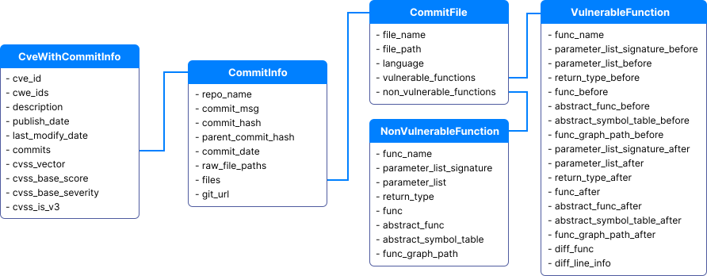
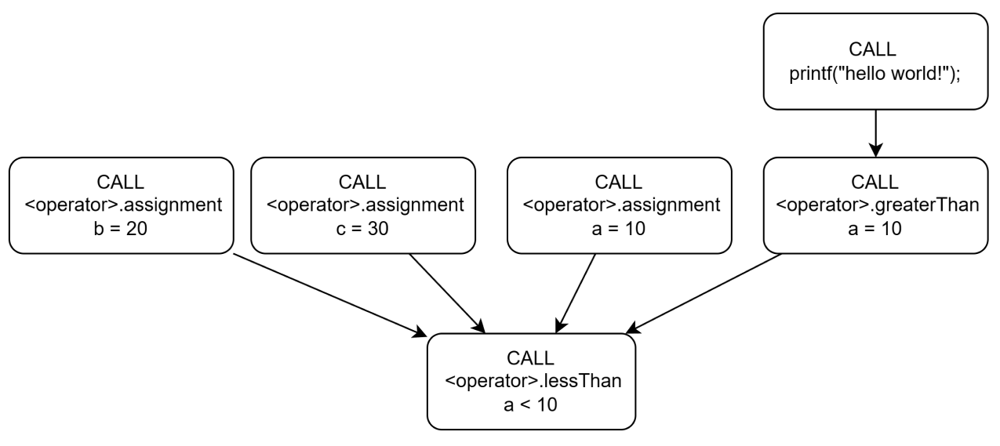
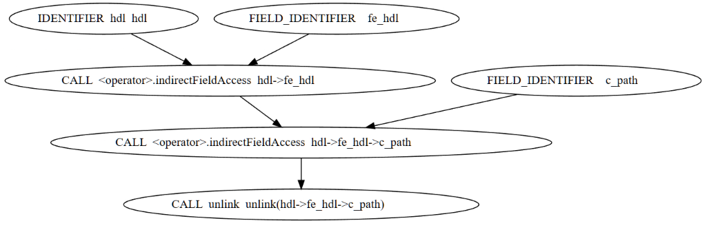
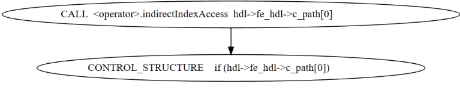
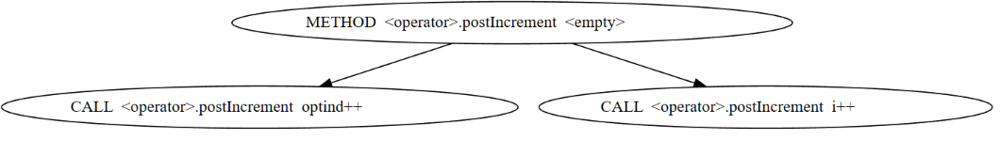
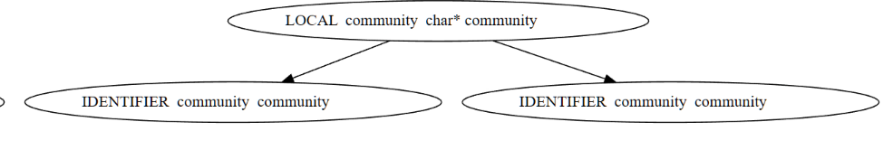
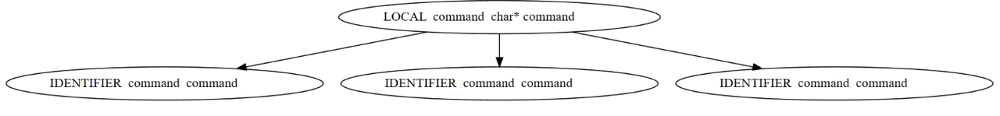

### **Specification**

- [Specification](#specification)
  - [Dataset Specification](#dataset-specification)
  - [Graph Specification](#graph-specification)
    - [Node](#node)
    - [Edge](#edge)
    - [Graph Samples](#graph-samples)

#### Dataset Specification

We provide **field** specification for the different versions of MegaVul for easier use (typing support).

You can also find the definition in the `megavul/git_platform/common.py`, `megavul/pipeline/flatten_megavul.py`.

1. `megavul_simple.json` provides the most commonly used fields of the dataset.
   The definitions are as follows

```python
from dataclasses import dataclass
from typing import Optional
@dataclass
class MegaVulSimpleFunction:
    cve_id: str
    cwe_ids: list[str]
    cvss_vector: Optional[str]
    cvss_is_v3: Optional[bool]

    repo_name: str
    commit_msg: str
    commit_hash: str
    git_url: str
    file_path: str
    func_name: str

    # when `is_vul = 1` xxxxx_before will exist, indicating a vulnerable function.
    func_before: Optional[str]
    abstract_func_before: Optional[str]
    func_graph_path_before: Optional[str | None]

    func: str
    abstract_func: str
    func_graph_path: str | None

    # diff info
    diff_func: Optional[str]
    diff_line_info: Optional[dict]  # [deleted_lines, added_lines]

    is_vul: bool
```

2. `megavul.json` is the version after `cve_with_graph_abstract_commit` flattened.

```python
@dataclass
class MegaVulFunction:
    cve_id: str
    cwe_ids: list[str]
    cvss_vector: Optional[str]
    cvss_base_score: Optional[float]
    cvss_base_severity: Optional[str]
    cvss_is_v3: Optional[bool]
    publish_date: str

    repo_name: str
    commit_msg: str
    commit_hash: str
    parent_commit_hash: str
    commit_date: int
    git_url: str

    file_path: str
    func_name: str
    # when `is_vul = 1` xxxxx_before will exist, indicating a vulnerable function.
    parameter_list_signature_before: Optional[str]
    parameter_list_before: Optional[list]
    return_type_before: Optional[str]
    func_before: Optional[str]
    abstract_func_before: Optional[str]
    abstract_symbol_table_before: Optional[dict]
    func_graph_path_before: Optional[str | None]

    parameter_list_signature: str
    parameter_list: list
    return_type: str
    func: str
    abstract_func: str
    abstract_symbol_table: dict
    func_graph_path: str | None

    # diff info
    diff_func: Optional[str]
    diff_line_info: Optional[dict]  # [deleted_lines, added_lines]

    is_vul: bool
```

3. `cve_with_graph_abstract_commit.json` provides the following hierarchical structure, which is raw
   state of the dataset. 
The following classes are defined in the [`megavul/git_platform/common.py`](megavul/git_platform/common.py)
- `CveWithCommitInfo`
- `CommitInfo`
- `CommitFile`
- `VulnerableFunction`
- `NonVulnerableFunction`




#### Graph Specification

The graphs of functions is extracted by **Joern**, and here we provide a detailed description of the field information
for both **nodes and edges**. You can also visit their [official website](https://cpg.joern.io/) for detailed information.

Joern provides a variety of graph information(i.e., AST, CFG, CDG, DDG, PDG, CPG ), please note the following rules:

- AST
- CFG
- PDG = CDG + DDG
- CPG = AST + CFG + PDG

NB: Joern **can't** export DFG(Data Flow Graph) for functions.

##### Usage

The `func_graph_path`, `func_graph_path_before` in MegaVul provides the relative path to the graph of function, and you
need to concatenate the paths to get the final json file.

e.g.

```python
graph_dir = Path('path_to_graph/graph')
graph_file_path = graph_dir / item['func_graph_path_before']

nodes = graph_file_path['nodes']  # graph nodes
edges = graph_file_path['edges']  # graph edges
```

##### Node

The following table lists the fields that may exist within nodes.

NB: **not all fields will be existed**, only `_label` is guaranteed to be existed.

| Field                    | Description                                                                                                                                                                                                                                                                                                  |
|--------------------------|--------------------------------------------------------------------------------------------------------------------------------------------------------------------------------------------------------------------------------------------------------------------------------------------------------------|
| _label                   | type of Node , possible types: `BINDING`,`BLOCK`,`CALL`,`COMMENT`,`CONTROL_STRUCTURE`,  `FIELD_IDENTIFIER`,`FILE`,`IDENTIFIER`,`JUMP_TARGET`,`LITERAL`,`LOCAL`, `META_DATA`,`METHOD`,`METHOD_PARAMETER_IN`,`METHOD_PARAMETER_OUT`, `METHOD_RETURN`,`NAMESPACE`,`NAMESPACE_BLOCK`,`RETURN`,`TYPE`,`TYPE_DECL` |
| argumentIndex            | position of the parameter in the called function                                                                                                                                                                                                                                                             |
| astParentFullName        | name of the AST parent node. e.g. `<global>`                                                                                                                                                                                                                                                                 |
| astParentType            | type of the AST parent node                                                                                                                                                                                                                                                                                  |
| name                     | function names, variable names, pseudo-node names                                                                                                                                                                                                                                                            |
| code                     | code corresponding to this node                                                                                                                                                                                                                                                                              |
| columnNumber             | node's column position in the source file                                                                                                                                                                                                                                                                    |
| columnNumberEnd          | end position of column in the source file                                                                                                                                                                                                                                                                    |
| lineNumber               | same as above                                                                                                                                                                                                                                                                                                |
| lineNumberEnd            |                                                                                                                                                                                                                                                                                                              |
| controlStructureType     | `WHILE`，`SWITCH`，`BREAK`，`IF`，`GOTO`，`FOR`                                                                                                                                                                                                                                                                   |
| dispatchType             | when the node type is `CALL`, this field exists                                                                                                                                                                                                                                                              |
| dynamicTypeHintFullName  |                                                                                                                                                                                                                                                                                                              |
| evaluationStrategy       | parameter pass by reference or pass by value                                                                                                                                                                                                                                                                 |
| filename                 | file name                                                                                                                                                                                                                                                                                                    |
| fullName                 | function name                                                                                                                                                                                                                                                                                                |
| id                       | node number to be referenced by edges                                                                                                                                                                                                                                                                        |
| index                    | similar to `argumentIndex`                                                                                                                                                                                                                                                                                   |
| inheritsFromTypeFullName |                                                                                                                                                                                                                                                                                                              |
| isExternal               | external functions, not in the source file                                                                                                                                                                                                                                                                   |
| isVariadic               | variadic parameter                                                                                                                                                                                                                                                                                           |
| language                 | file language                                                                                                                                                                                                                                                                                                |
| methodFullName           | when the node type is `CALL`, `methodFullName` is the called function name                                                                                                                                                                                                                                   |
| canonicalName            |                                                                                                                                                                                                                                                                                                              |
| order                    |                                                                                                                                                                                                                                                                                                              |
| overlays                 | overlay used by Joern to parse functions. e.g. `Dataflow Overlay`                                                                                                                                                                                                                                            |
| parserTypeName           | parsed label, goto, if statement. e.g. `CASTIfStatement`                                                                                                                                                                                                                                                     |
| root                     | source file path                                                                                                                                                                                                                                                                                             |
| signature                | function signature                                                                                                                                                                                                                                                                                           |
| typeDeclFullName         |                                                                                                                                                                                                                                                                                                              |
| typeFullName             |                                                                                                                                                                                                                                                                                                              |
| version                  |                                                                                                                                                                                                                                                                                                              |

##### Edge

Edges connect nodes to nodes, forming various graphs, and the other three fields are guaranteed to be present, except
for `variable`.

| Field    | Description                                                                                                                                                                               |
|----------|-------------------------------------------------------------------------------------------------------------------------------------------------------------------------------------------|
| inNode   | start node of the edge                                                                                                                                                                    |
| outNode  | end node of the edge                                                                                                                                                                      |
| label    | type of edge: `ARGUMENT`,`AST`,`BINDS`,`CALL`,`CDG`, `CFG`,`CONDITION`, `CONTAINS`,`DOMINATE`,`EVAL_TYPE`,`PARAMETER_LINK`,`POST_DOMINATE`, `REACHING_DEF`,`RECEIVER`,`REF`,`SOURCE_FILE` |
| variable | variable referenced by edge                                                                                                                                                               |

The most useful types of edges: `AST`, `CDG`, `CFG`, `REACHING_DEF`(aka. DDG)

##### Graph Samples

We exported some less common types of graph to help you understand their meaning more easily.

1. CDG

Control dependency graph

```c
int main(){
    int a = 10;
    while (a < 10) {
        int b = 20;
        int c = 30;
    }
    a = 10;
    if ( a > 10 ){
        printf("hello world!");
    }
}
```



2. CFG

Control flow graph

```c
unlink(hdl->fe_hdl->c_path)
```


3. ARGUMENT

AST for function call arguments



4. CONDITION

Conditions for control statements




4. CALL

Definition of function and call points



5. REF

Definition and reference location of local variables




